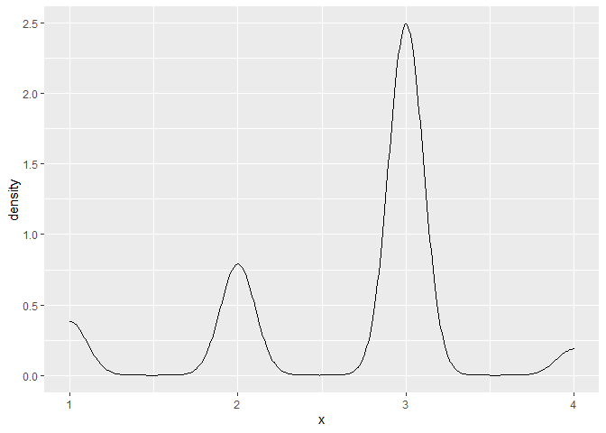
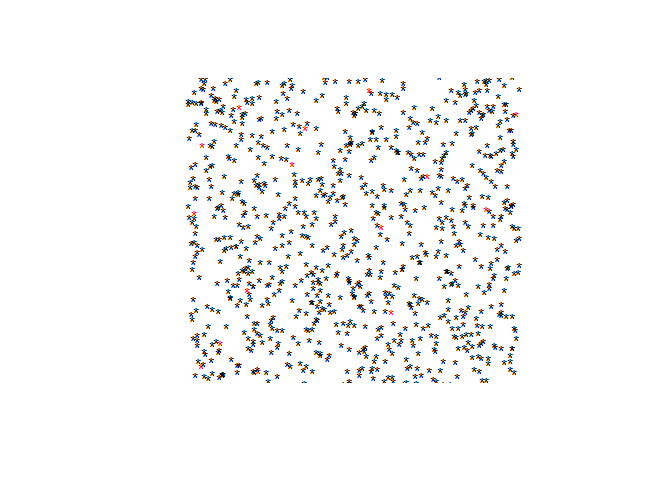
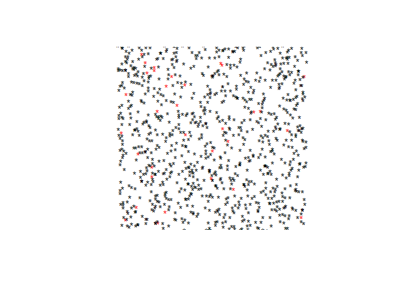
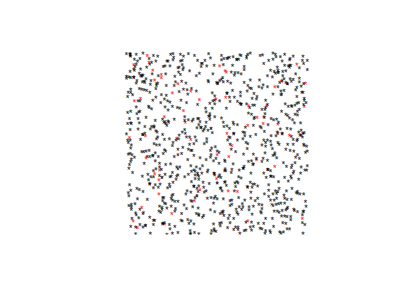
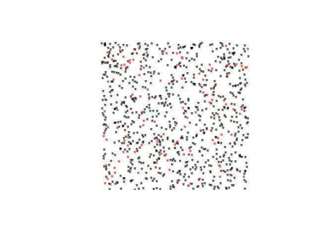

README
================
Jacob Hutton
9/7/2022

Infectious diseases have different traits, which must be considered
during modelling.

Some diseases are vector borne, others are transmitted through aerosols,
blood, etc.

When writing models of pathogen spread in a population, we need to first
ascertain the stage of the disease spread. Epidemics refer to periods of
transmission of a fairly new disease, where everyone is susceptible. On
the other hand, endemic situations refer to a more open ended model,
which assumes that the disease has already been circulating in the
population and is unlikely to become extinct.

We must also consider the population at risk. Is it a fixed (closed) or
dynamic (open) population of individuals? Dynamic populations must take
into account individuals becoming at risk and ceasing to be at risk,
perhaps through migration, death, age, etc.

Let’s think about an early phase model for an epidemic. In this
situation, 1 individual with the new disease has arrived into a
population of at risk individuals. For this new strain, we would like to
instantiate a model that answers:

    1. What is the likelihood of a large epidemic?

    2. How fast does the epidemic run?

    3. What fraction of the population will be infected with this new
strain?

From a policy standpoint, the answers to the above questions may also
inform control measures. What sort of control strategies may be most
effective given the nature of the new viral dynamics? We can seek to
answer this with a model as well.

Let’s define *contact rate c* as a rate of contact between an infected
individual and susceptible individuals per day.

We also define an infectious period as the period following the end of
the incubation period (*t1*), and prior to the onset of recovery (*t2*).
During this time an infected individual can pass the disease to other
individuals.

The likelihood of this passage from the infected individual to the
susceptible individual is defined by the *probability p* of transmission
per contact. *p* is a value bounded by 0 and 1.

Focusing on the early phase of our new epidemic, in this phase all
contacts will be with susceptible individuals. In this case, the total
average number of new infections from 1 infected person at the beginning
of the epidemic will be equal to the contact rate *c* times the
probability of transmission *p* times the length of time that an
individual is infectious.

We can express the above in equation form as:

c x p(t2-t1)

This is known as the base reproductive number: R0. As the epidemic
evolves, this value will change depending on the number of susceptible
individuals, changes in behaviour, and possible pathogen evolution.

This R0 is an average obtained from observationl studies on the dynamics
of pathogen transmission. We can disintegreate this average by defining
qk as the probability that an infectious person produces k infectious
offspring. For example, q1 would be the probability that 1 individual is
infected, and q2 would be the probability that 2 are infected. For a
density space of 1-&gt;n values of k, we can plot the probabiltiy
distribution of q.

    ## Loading required package: tidyverse

    ## Warning: package 'tidyverse' was built under R version 4.0.5

    ## -- Attaching packages --------------------------------------- tidyverse 1.3.1 --

    ## v ggplot2 3.3.5     v purrr   0.3.4
    ## v tibble  3.1.0     v dplyr   1.0.7
    ## v tidyr   1.1.4     v stringr 1.4.0
    ## v readr   1.4.0     v forcats 0.5.1

    ## Warning: package 'ggplot2' was built under R version 4.0.5

    ## Warning: package 'tibble' was built under R version 4.0.4

    ## Warning: package 'tidyr' was built under R version 4.0.5

    ## Warning: package 'readr' was built under R version 4.0.4

    ## Warning: package 'purrr' was built under R version 4.0.5

    ## Warning: package 'dplyr' was built under R version 4.0.5

    ## Warning: package 'stringr' was built under R version 4.0.5

    ## Warning: package 'forcats' was built under R version 4.0.5

    ## -- Conflicts ------------------------------------------ tidyverse_conflicts() --
    ## x dplyr::filter() masks stats::filter()
    ## x dplyr::lag()    masks stats::lag()

<!-- -->

It appears that the distribution is multimodal, but the bulk of
observations aggregate around 3, suggesting that the R0 of the new
strain is 3.

Let’s instantiate a population, with a random allocation of infected
individuals. As this is a new epidemic, we will assume that all
non-infected individuals are at-risk, and that this is a closed
population.

Now let’s model a spatially transmitted infection

    ## 
    ##   0   1 
    ## 985  15

At baseline, only 15 out of 1000 individuals have the pathogen

<!-- -->

This is the population at the beginning of the simulation.

Now we can compute the distances to infected individuals for all
susceptible individuals.

Now we have a matrix of distances, with the distance to the infected
individuals for each of the susceptible individuals. We can simulate
transmission to susceptible individuals based on the disperson of the
virus, parameterized by the *transmission radius*.

    ## 
    ##   0   1 
    ## 967  18

We’ll modify the initial population with the new infected statuses to
represent dynamic spread based on proximity.

    ## 
    ##   0   1 
    ## 985  15

Plot the updated population

<!-- -->

Finally, we can apply a random movement function to the points to
simulate spatial movement

So the whole simulation is composed of repeating the following
functions:

    ## 
    ##   0   1 
    ## 985  15

    ## 
    ##   0   1 
    ## 953  32

<!-- -->

    ## 
    ##   0   1 
    ## 953  32

    ## 
    ##   0   1 
    ## 953  32

    ## 
    ##   0   1 
    ## 889  64

<!-- -->

    ## 
    ##   0   1 
    ## 889  64

    ## 
    ##   0   1 
    ## 889  64

    ## 
    ##   0   1 
    ## 765 124

<!-- -->

    ## [1] "Simulation Complete"

Let’s run the simulation
